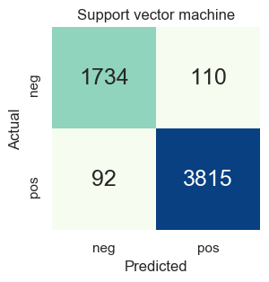

# Sentiment analysis of hotel reviews

## Problem description
Our goal is to perform sentiment analysis of textual reviews of hotel stays. We want to understand whether the users expressed positive or negative feelings in their comments. To do this, we build a binary classification model that is able to predict the sentiment contained in hotel reviews.

The dataset contains more than twenty thousand hotel reviews, scraped from the [tripadvisor.it](https://www.tripadvisor.it/) Italian website. Each review is labeled either positive or negative. The Polytechnic University of Turin has provided this dataset for the Data Science Lab: Process and methods exam project in the academic year 2019/2020.

## Implementation
Python 3.7.5 and [Jupyter Notebook](https://jupyter.org/) along with the following packages are required to run the code.

- [scikit-learn](https://scikit-learn.org/) 0.22
- [NumPy](https://numpy.org/) 1.17.4
- [pandas](https://pandas.pydata.org/) 0.25.3
- [Natural Language Toolkit](https://www.nltk.org/) 3.4.5
- [emoji](https://github.com/carpedm20/emoji) 0.5.4
- [Matplotlib](https://matplotlib.org/) 3.1.1
- [seaborn](https://seaborn.pydata.org/) 0.9.0
- [WordCloud](https://github.com/amueller/word_cloud) 1.5.0

## Data exploration
The dataset contains 28784 labeled reviews.

|       |                                              text | class |
|------:|--------------------------------------------------:|-------|
|     0 | Non è l'hotel più lussuoso in cui abbia mai so... | pos   |
|     1 | Siamo stati qui per 1 notte prima della nostra... | pos   |
|     2 | Hotel è ben posizionato per visitare Torino. A... | pos   |
|     3 | All'arrivo la cordialità e disponibilità dello... | pos   |
|     4 | Abbiamo soggiornato per due notti alla fine de... | pos   |
|   ... |                                               ... | ...   |
| 28749 | L'hotel è vecchio ma caratteristico e devo dir... | neg   |
| 28750 | Per essere un 4 stelle L la camera era un pò s... | pos   |
| 28751 | Io e mia mamma (di età compresa tra 23 e 62) s... | pos   |
| 28752 | Ci siamo sentiti accolti e coccolati fin dall'... | pos   |
| 28753 | Soggiorno fantastico in una posizione fantasti... | pos   |

Each row of the dataset consists of two fields:
- `text` contains the review written by the user
- `class` contains a label that specifies the sentiment of the review, either `pos` or `neg`, labelling the sentiment of the review as positive or negative.

A first analysis of the data shows that there are no missing values or empty strings.

The following plot shows the distribution of the two classes `pos` and `neg`. The dataset is not well balanced, as most reviews are labeled as positive.

The dataset has been scraped from the TripAdvisor Italian website, therefore we expect to find comments written in Italian. Further exploration reveals reviews written in other languages such as English and Spanish. Chinese characters are present as well. This suggests that they were originally written in another language and subsequently translated to Italian.

The following plot shows the distribution of review length. For better visualization, we only take into account reviews with length that falls within the 95th percentile. This means that reviews with more than 1800 characters are not considered.

There is a slight difference between the length of positive and negative reviews. Positive reviews are usually more concise than negative ones, which suggests that users who had a bad experience tend to write more in-depth comments. Furthermore, both distributions are positively skewed, meaning that most users do not write very long reviews. In fact, the majority of reviews have at most about 500 characters.

A number of reviews contain spelling errors. We are not sure of the impact on classification error caused by wrong spelling, but we assume that most misspelled words do not repeatedly appear in the dataset and therefore will be pruned in the data preprocessing step. We can also find words with repeated characters (e.g., “molto” may be written like “moooltoo”). We will handle these words in preprocessing with a basic spell correction algorithm.

Many reviews contain Unicode emojis such as `❤️` and `😠`, and text emoticons such as `:)` and `:(`. These characters express sentiment and we shall consider them when building the classification model [[1]](#references).

## Data preprocessing
The dataset contains textual data from which we must extract a set of features. In fact, most data mining algorithms are unable to directly process text in its original form. Therefore, we carry out a data preprocessing procedure that comprises tokenization, stopword removal, basic spell correction and stemming. Finally, we apply the term frequency-inverse document frequency (TFIDF) weighting scheme to transform the collection of reviews into numerical feature vectors.

### Tokenization and stemming
The tokenizer begins by dividing the document into substrings, or tokens, on any non-alphanumeric character it encounters when scanning the text.

It handles text emoticons by looking for the strings `:)` and `:(`, and Unicode emojis with the help of the library [emoji](https://github.com/carpedm20/emoji). It creates a token for every one of these symbols present in the text. It discards punctuation tokens unless it finds an exclamation mark, a question mark or a currency symbol (`€` and `$`), as we speculate they carry additional meaning and may be useful to the classification algorithm.

It removes any non-alphabetic character and does not consider tokens of length greater than _wupper_ or less than _wlower_. Then, it applies a basic spell checking algorithm to the accepted tokens. It removes repeating characters from the beginning and the end of the token, and removes characters that are repeated more than twice in the middle of the token (e.g., “cciaaaaooo” becomes “ciaao”). This is not a perfect solution, but it should correct many spelling errors and, most importantly, it should produce tokens that will be correctly stemmed.

It deletes words that appear in the Italian stopword list provided by the Natural Language Toolkit library, a list of the most common words in the Italian language that are likely to have little semantic meaning. We modify the stopword list by adding “hotel”, which appears frequently in hotel reviews and does not have any positive or negative connotation, and remove “non”, which expresses negativity.

As a final step, we use a stemmer to reduce inflected words to their root form (e.g., “parlare” becomes “parl”). We use a stemmer instead of a lemmatizer or a part-of-speech tagging algorithm as it runs significantly faster, can be easily implemented for languages other than English and delivers satisfying results for classifying tasks such as ours. We use the [Snowball](https://snowballstem.org/) stemmer which provides an algorithm for the Italian language. It is included in the Natural Language Toolkit library.

We provide an example of our tokenization and stemming output. Consider the following sentence: “Il nostro soggiorno è stato davvero fantasticooo!”. It will be transformed into the following list of tokens: `soggiorn`, `stat`, `davver`, `fantast`, `!`. Note that the stemmer converts all uppercase characters to lowercase.

### Weighting scheme
The tokenizer produces a list of tokens for every document in the collection. We use the bag-of-words model to represent the whole collection of reviews. Every token produced by the tokenizer is considered as a separate feature, therefore a document is represented by a vector of weights, one for each distinct token. The weight of each token is computed with the term frequency-inverse document frequency (TFIDF) weighting scheme.

Suppose we want to apply the TFIDF scheme to the following sample dataset, consisting of three documents.

- L'hotel ha una posizione molto buona.
- La stanza non è ben pulita.
- L'hotel è molto pulito e la stanza è molto bella!

After tokenization and stemming, we obtain the following tokens.

- `posizion`, `molt`, `buon`
- `stanz`, `non`, `ben`, `pul`
- `molt`, `pul`, `stanz`, `molt`, `bell`, `!`

The TFIDF matrix representation of this sample dataset is the following. Rows represent document vectors and columns represent different features.

|   | `!`    | `bell` | `ben`  | `buon` | `molt` | `non`  | `posizion` | `pul`  | `stanz` |
|---|--------|--------|--------|--------|--------|--------|------------|--------|---------|
| 0 | 0.0000 | 0.0000 | 0.0000 | 0.6228 | 0.4736 | 0.0000 | 0.6228     | 0.0000 | 0.0000  |
| 1 | 0.0000 | 0.0000 | 0.5628 | 0.0000 | 0.0000 | 0.5628 | 0.0000     | 0.4280 | 0.4280  |
| 2 | 0.4276 | 0.4276 | 0.0000 | 0.0000 | 0.6503 | 0.0000 | 0.0000     | 0.3252 | 0.3252  |

More information about the computation of weights using this schema can be found on [scikit-learn's feature extraction module documentation](https://scikit-learn.org/stable/modules/feature_extraction.html#tfidf-term-weighting). In a nutshell, tokens occurring frequently in a single document but rarely in the whole collection have more weight.

We convert our document collection to a matrix of TFIDF features with [scikit-learn's TFIDF vectorizer](https://scikit-learn.org/stable/modules/generated/sklearn.feature_extraction.text.TfidfVectorizer.html). The vectorizer extracts unigrams and bigrams from the documents, i.e., features consisting of single tokens and contiguous sequences of two tokens respectively. For example, consider the sentence “La stanza non è ben pulita”. The tokenizer produces four tokens: `stanz`, `non`, `ben`, `pul`. Therefore, the vectorizer extracts the following seven features: `stanz`, `non`, `ben`, `pul`, `stanz non`, `non ben`, `ben pul`.

To improve the effectiveness of the classifier and avoid the [curse of dimensionality](https://en.wikipedia.org/wiki/Curse_of_dimensionality), we limit the number of features that we extract from the dataset. Therefore, we drop features (terms) that appear in less than _dfmin_ documents and set a maximum number of features _fmax_.

### Word clouds
The following images are [word clouds](https://en.wikipedia.org/wiki/Tag_cloud), representing the frequencies of the extracted terms contained in positive and negative reviews respectively. Bigger words appear more frequently in our dataset.

## Algorithm choice
We use a supervised learning algorithm to train a classifier able to identify positive and negative reviews accurately.

There are many algorithms available to perform text classification. Naive Bayes and support vector machines are very effective in high-dimensional spaces, and both methods are highly regarded in academic literature for sentiment analysis tasks [[2]](#references) [[3]](#references) [[4]](#references). For these reasons, we take both into consideration.

The scikit-learn library provides a set of naive Bayes classifier implementations, including [multinomial naive Bayes](https://scikit-learn.org/stable/modules/naive_bayes.html#multinomial-naive-bayes) and [complement naive Bayes](https://scikit-learn.org/stable/modules/naive_bayes.html#complement-naive-bayes). The latter is an adaptation of the standard multinomial algorithm that is particularly suited for imbalanced dataset such as ours. The library also provides [C-support vector classification (SVC)](https://scikit-learn.org/stable/modules/generated/sklearn.svm.SVC.html), a support vector machine algorithm that employes a regularization parameter.

In order to understand which model is best suited to our task, we compare multinomial and complement naive Bayes classifiers to support vector machines, and in particular to SVC. Our main metric to measure performance is the [weighted F1 score](https://en.wikipedia.org/wiki/F1_score), which accounts for class distribution imbalance.

While the naive Bayes classifiers are significantly faster in training and prediction, the support vector machine performs slightly better. The speed difference becomes more significant as the dataset grows larger.

For two-class, separable training datasets, the support vector machine searches for a linear separator between the classes. It looks for a decision hyperplane that is maximally far away from any data point in the training set. Our training set is a two-class dataset and seems to be sufficiently separable by a linear model, as the results of hyper-parameter tuning point out. Therefore, the best suited kernel for our data is the linear kernel. We choose a regularization parameter _C0_.

## Tuning and validation
We split the original dataset into a training set and a test set. The classifier fits to the training set, while the test set is reserved for evaluation. To ensure that the class distribution of both sets are similar, we use [scikit-learn's `train_test_split`](https://scikit-learn.org/stable/modules/generated/sklearn.model_selection.train_test_split.html) with the parameter `stratify`. We hold out twenty percent of the available data as a test set and use the remaining eighty percent for training and validation.

### Preprocessing tuning
The multinomial naive Bayes classifier is our baseline to tune our data preprocessing procedure, as this model is very fast in training and prediction. The additive smoothing parameter is set to _α_ = 1. We use the test set to evaluate all parameter changes.

First, we tune the parameters of the tokenizer. We set _wupper_ = 20 and consider different values for _wlower_. We get the best results by using _wlower_ = 3. If we use a higher value, we ignore too many important features, such as the token “non” that prevails in negative reviews. If we use a lower value, we introduce a large amount of noise that degrades the performance of our classifier.

Retaining both alphabetic and numeric characters results in worse performance than only keeping alphabetic characters, thus we discard digits. Moreover, the tokenizer removes words belonging to the set of Italian stopwords, which we modify by removing the word “non” and adding the domain-specific word “hotel”. This yields better predictions.

After tuning the tokenizer, we change the parameters of the TFIDF vectorizer. We set _dfmin_ = 2 to ignore all features that appear in only one document. This reduces the number of features from almost 700000 to less than 200000. However, the number of features is still an order of magnitude greater than the number of samples. Therefore, we set an upper bound of _fmax_ = 15000 features. The classifier now reaches a weighted F1 score of 0.9551, which means that it is able to correctly classify most of the test set.

### Model training, tuning and validation
We train three classifiers using the multinomial and complement naive Bayes algorithms and the C-support vector classification method.

The optimal set of hyper-parameter for each classifier is chosen by performing a grid search with 5-fold cross-validation. Hyper-parameters control the learning process of the algorithms, therefore we should set their value before the training begins. The only hyper-parameter for naive Bayes classifiers is the additive smoothing parameter _α_. The C-support vector classification algorithm has a regularization parameter _C_ and the choice of a kernel between linear, polynomial, radial basis function and sigmoid.

We use the grid search approach to search exhaustively a subset of the hyper-parameter space for the best performing model, using the weighted F1 score as our metric.

For both of the naive Bayes classifiers, we search for the best additive smoothing parameter value between 0.1 and 1, with increments of 0.1. The hyper-parameter value that gives the best results is _α_ = 0.1 for both classifiers. For the support vector machine, we search for the best regularization parameter value between 0.01, 0.1, 1, 10 and 100 and the best kernel among the available ones. The combination of hyper-parameters that performs best is _C_ = 1 with the linear kernel.

To find the best hyper-parameter combination among candidate classifiers generated by the grid search, we use _K_-fold cross-validation with _K_ = 5 folds. This procedure consists in splitting the training set into _K_ sets, or folds, and for each one of them train a model using _K_-1 folds and validate it on the remaining fold. The performance measure is the average of the weighted F1 values computed at each step.

This cross-validation technique solves the problem of holding out another portion of the training set for validation. In fact, the test set is reserved for evaluating the _final_ model fit and its generalization performance, therefore we cannot use it for hyper-parameter tuning. By using cross-validation, we do not need any dedicated validation set.

### Model comparison
The multinomial naive Bayes and the complement naive Bayes classifiers have very similar weighted F1 scores, respectively 0.9553 and 0.9554. However, the confusion matrices highlight their differences, albeit small. The complement naive Bayes performs slightly better at predicting the sentiment of negative reviews, and slightly worse on positive reviews.

 

The C-support vector classification algorithm performs slightly better than both naive Bayes classifiers, reaching a weighted F1 score of 0.9648. The confusion matrix shows that the support vector machine performs better than the naive Bayes classifiers in predicting the sentiment of positive reviews, while it misclassifies a higher number of negative reviews.

The most significant difference between the naive Bayes classifiers and the support vector machine is the speed of training and prediction.

## References
[1] Alexander Hogenboom, Daniella Bal, Flavius Frasincar, Malissa Bal, Franciska de Jong, and Uzay Kaymak. *Exploiting emoticons in sentiment analysis.* In Proceedings of the 28th Annual ACM Symposium on Applied Computing - SAC ’13, page 703, Coimbra, Portugal, 2013. ACM Press.

[2] Kamran Kowsari, Kiana Jafari Meimandi, Mojtaba Heidarysafa, Sanjana Mendu, Laura E. Barnes, and Donald E. Brown. *Text Classification Algorithms: A Survey.* Information, 10(4):150, April 2019. arXiv: 1904.08067.

[3] Akrivi Krouska, Christos Troussas, and Maria Virvou. *Comparative Evaluation of Algorithms for Sentiment Analysis over Social Networking Services.* page 14, 2017.

[4] Christopher D. Manning, Prabhakar Raghavan, and Hinrich Schütze. *Introduction to information retrieval.* Cambridge University Press, New York, 2008. OCLC: ocn190786122.
