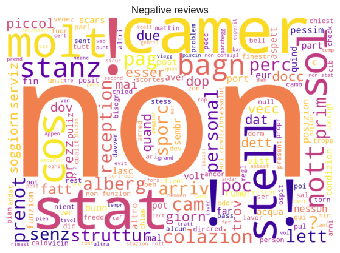

# Sentiment analysis of hotel reviews

## Problem description
We perform a sentiment analysis of textual reviews of hotel stays. We want to understand whether the users expressed positive or negative feelings in their comments. To do this, we build a binary classification model that is able to predict the sentiment contained in hotel reviews.

We use a dataset that contains more than twenty thousand hotel reviews, scraped from the [tripadvisor.it](https://www.tripadvisor.it/) Italian website. Each review is labeled either positive or negative. The Polytechnic University of Turin has provided this dataset for the Data Science Lab: Process and methods exam project in the academic year 2019/2020.

## Implementation
We use Python 3.7.5 and [Jupyter Notebook](https://jupyter.org/). The following packages are required to run the code. We use the specified package versions.
- [scikit-learn](https://scikit-learn.org/) 0.22
- [NumPy](https://numpy.org/) 1.17.4
- [pandas](https://pandas.pydata.org/) 0.25.3
- [Natural Language Toolkit](https://www.nltk.org/) 3.4.5
- [emoji](https://github.com/carpedm20/emoji) 0.5.4
- [Matplotlib](https://matplotlib.org/) 3.1.1
- [seaborn](https://seaborn.pydata.org/) 0.9.0
- [WordCloud](https://github.com/amueller/word_cloud) 1.5.0

## Data exploration
The dataset contains 28784 labeled reviews. We show its structure in the following table.

|       |                                              text | class |
|------:|--------------------------------------------------:|-------|
|     0 | Non è l'hotel più lussuoso in cui abbia mai so... | pos   |
|     1 | Siamo stati qui per 1 notte prima della nostra... | pos   |
|     2 | Hotel è ben posizionato per visitare Torino. A... | pos   |
|     3 | All'arrivo la cordialità e disponibilità dello... | pos   |
|     4 | Abbiamo soggiornato per due notti alla fine de... | pos   |
|   ... |                                               ... | ...   |
| 28749 | L'hotel è vecchio ma caratteristico e devo dir... | neg   |
| 28750 | Per essere un 4 stelle L la camera era un pò s... | pos   |
| 28751 | Io e mia mamma (di età compresa tra 23 e 62) s... | pos   |
| 28752 | Ci siamo sentiti accolti e coccolati fin dall'... | pos   |
| 28753 | Soggiorno fantastico in una posizione fantasti... | pos   |

We can see that each row of the dataset consists of two fields: `text` contains the review written by the user, and `class` contains a label that specifies the sentiment of the review. We note that the `class` field only contains one of two values, `pos` or `neg`, labelling the sentiment of the review as positive or negative.

A first analysis of the data shows that there are no missing values or empty strings. We plot the distribution of the two classes and we show that the dataset is not well balanced, as most reviews are labeled as positive.

The dataset has been scraped from the TripAdvisor Italian website, therefore we expect to find comments written in Italian. Further exploration reveals reviews written in other languages such as English and Spanish. Chinese characters are present as well. This suggests that they were originally written in another language and subsequently translated to Italian.

We show the distribution of review length in the following plot. For better visualization, we only take into account reviews with length that falls within the 95th percentile. This means that reviews with more than 1800 characters are not considered.

We can see that there is a slight difference between the length of positive and negative reviews. It appears that positive reviews are usually more concise than negative reviews, which suggests that users who had a bad experience tend to write more in-depth comments. Furthermore, both distributions are positively skewed, meaning that most users do not write very long reviews. In fact, we find that the majority of reviews have at most about 500 characters.

A number of reviews contain spelling errors. We do not know the amount of misclassification errors caused by wrong spelling, but we assume that most misspelled words do not repeatedly appear in the dataset and therefore will be pruned in the data preprocessing step. We can also find words with repeated characters (e.g., “molto” may be written like “moooltoo”). We will handle these words in preprocessing with a basic spell correction algorithm.

Many reviews contain Unicode emojis such as `❤️` and `😠`, and text emoticons such as `:)` and `:(`. These characters express sentiment and we shall consider them when building the classification model.

## Data preprocessing
The dataset contains textual data from which we must extract a set of features. In fact, most data mining algorithms are unable to directly process text in its original form. Therefore, we carry out a data preprocessing procedure that comprises tokenization, stopword removal, basic spell correction and stemming. Finally, we apply the term frequency-inverse document frequency (TFIDF) weighting scheme to transform the collection of reviews into numerical feature vectors.

### Tokenization and stemming
The tokenizer begins by dividing the document into substrings, or tokens, on any non-alphanumeric character it encounters when scanning the text.

It handles text emoticons by looking for the strings `:)` and `:(`, and Unicode emojis with the help of the library [emoji](https://github.com/carpedm20/emoji). It creates a token for every one of these symbols present in the text.

It discards punctuation tokens unless it finds an exclamation mark, a question mark or a currency symbol (`€` and `$`), as we speculate they carry additional meaning and may be useful to the classification algorithm.

It removes any non-alphabetic character and does not consider tokens of length greater than wupper or less than wlower. Then, it applies a basic spell checking algorithm to the accepted tokens. It removes repeating characters from the beginning and the end of the token, and removes characters that are repeated more than twice in the middle of the token (e.g., “cciaaaaooo” becomes “ciaao”). This is not a perfect solution, but it should correct many spelling errors and, most importantly, it should produce tokens that will be correctly stemmed.

It deletes words that appear in the Italian stopword list provided by the Natural Language Toolkit library. We add the word “hotel” which appears frequently in hotel reviews, as it does not have any positive or negative connotation. We remove the word “non” from the stopword list, which expresses negativity and therefore may be useful for a sentiment analysis task.

As a final step, we use a stemmer to reduce inflected words to their root form (e.g., “parlare” becomes “parl”). We use a stemmer instead of a lemmatizer or a part-of-speech tagging algorithm as it runs significantly faster, can be easily implemented for languages other than English and delivers satisfying results for classifying tasks such as ours. We use the [Snowball](https://snowballstem.org/) stemmer which provides an algorithm for the Italian language. It is included in the Natural Language Toolkit library.

### Weighting scheme

### Word clouds
We show two word clouds representing the frequencies of the extracted terms contained in positive and negative reviews respectively. Bigger words appear more frequently in our dataset.

